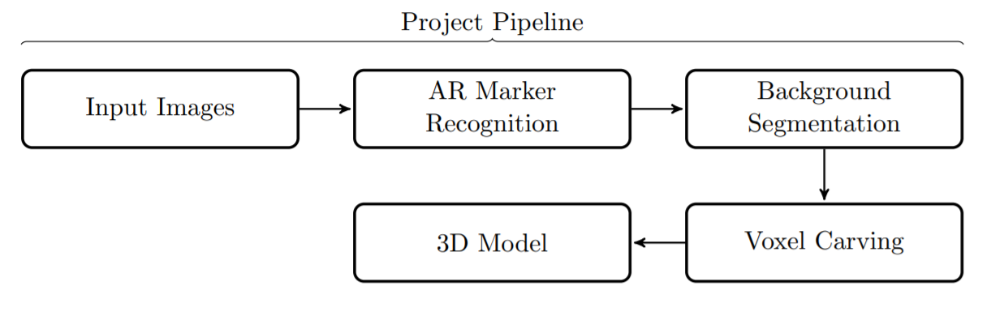
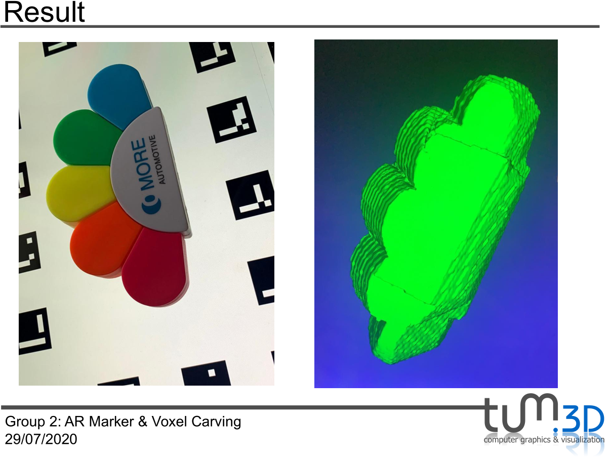

# Voxel Carving of 3D Surfaces using AR Markers for Pose Estimation
TUM - 3D Scanning and Motion Capture class final project.

### Voxel Carving
"Voxel  carving  is  a  technique to reconstruct voxels of a 3D surface from multiple images taken from different angles."  [4] [6]

### Abstract
In the recent years, Augmented Reality (AR) has gained increasing interest in researches, especially in the field of 3D modelling, and is used for different applicational purposes. In this project, AR will be applied to recognize markers [1] and the results of a 3D reconstruction using voxel carving will be visualized and placed on the markers [5]. Voxel carving is a technique to reconstruct voxels of a 3D surface from multiple images taken from different angles [4] [6]. This is achieved by separating the fore- and background in the images and then shaping the 3D mesh through the object silhouettes from different camera angles, a process called shape-from-silhouette [5].

### Prerequisites
- Image Dataset containing multiple images of the 3D Surface from different points of view
- Camera Calibration
- AR Marker Detection
- Pose Estimation
- Background Segmentation
- Voxel Carving
- Final Rendering

### Requirements
- OpenCV Library for Camera Calibration
- ArUco Library for Camera Pose Estimation
- VTK Library for rendering the final reconstruction

### Reconstruction Example

  

### References
- [1]  Aruco: An   efficient   library   for   detection   of   planar   markers   and   camera   pose  estimation. https://docs.google.com/document/d/1QU9KoBtjSM2kF6ITOjQ76xqL7H0TEtXriJX5kwi9Kgc.
- [2]  Voxel-carving.  https://github.com/xocoatzin/Voxel-Carving, 2013.
- [3]  Voxel carving.  https://subokita.com/2014/08/14/voxel-carving, 2014. 
- [4]  Thomas  Bonfort  and  Peter  Sturm.   Voxel  carving  for  specular  surfaces. Proceedings Ninth IEEE International Conference on Computer Vision, 1:591–596, 2003.
- [5]  Andreas Hartl,  Lukas Gruber,  Clemens Arth,  Stefan Hauswiesner,  and Dieter Schmalstieg.  Rapid reconstruction of small objects on mobile phones. Proceedings of CVPR 2011, pages 20–27, 2006.
- [6]  Kiriakos N. Kutulakos and Steven M. Seitz. A theory of shape by space carving. International Journal of Computer Vision, 3 (38): 199–218, 2000.
